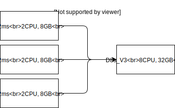

class: center, middle

# Real-Time Web Applications At Scale
## with ASP.NET Core SignalR

---
# Manual approach


---
# Clever approach

```javascript
setTimeout(() => location.reload(true), 1000);
```

---
# Real Time Web

* Bi-directional communication
* Low latency
* Any browser

???

Pushing real-time data to any browser instead of waiting for the browser to poll the server and retrieve new data.

---
# Low-level options

* Java applets (as of Netscape 2.0, March 1996)
* Server Push / Reverse AJAX / Comet
    * HTTP Polling
    * HTTP Long Polling
    * HTTP Streaming
* Server-sent events
* WebSocket Protocol
* ~~HTTP/2 Server Push~~

???

* Long polling
  * Hanging-GET
  * Always a pending request to which the server can reply, minimising latency in message delivery
  * Not awesome for small messages, as headers are sent with each request/response

* Server-sent events
  * EventSource API is standardised as part of HTML5
  * Not supported by IE or Edge

* Websockets
  * [RFC 6455](https://tools.ietf.org/html/rfc6455) first draft in February 2010, finalised in December 2011.
  * Most browsers had implemented it by 2012
  * Not bound by Cross-origin requests (CORS)

---
# High-level options

* Lightstreamer
* Ajax Push Engine (APE)


* Socket.IO
* SignalR
* <https://www.leggetter.co.uk/real-time-web-technologies-guide/>

???

* Lightstreamer
  * Created at the end of 2000
  * Startup-edition price starts at $1200/year, otherwise contact sales
  * First customers were financial instutitions, in 2010 NASA set up LightStreamer to relay telemetry from the ISS
* APE
  * Open source

---
# ASP.NET SignalR

* Originally created in 2011 by [David Fowler](https://github.com/davidfowl) and [Damien Edwards](https://github.com/DamianEdwards).
* Released as part of ASP.NET in 2013
* Support >= IE8
* Scaleout with Azure Service Bus, Redis, SQL Server

???

* .NET JavaScript client depended on jQuery

---
# ASP.NET Core SignalR

* Complete rewrite
* Automatic reconnects aren't supported, reconnection must be explicit.
* Streaming
* JavaScript client is on npm
* No more jQuery
* Supports >= IE11
* Scaleout with Redis, Azure SignalR Service
* <https://docs.microsoft.com/en-us/aspnet/core/signalr/version-differences>

???

* ASP.NET Core
  * MessagePack is an efficient binary serialization format
  * Sticky sessions required due to limitation that all clients stay on the same server. This limitation does not exist on Azure SignalR Service

---
# Azure SignalR Service

* Scale
* $68/month per 1,000 connections 

  1mil messages then $1.37 per 1mil messages.

* Max 100,000 connections (default)
* Serverless

  Send to client(s) only

---
# Load testing SignalR

* 236k tweet
* C10k/C10M
* Crank / Crankier

---
class: center, middle

# Local client


---
class: center, middle

# Containers


---
class: center, middle

# Containers


---
class: center, middle

# Virtual Machines



---
# Costs
## Server

.pure-table.pure-table-striped.smaller-font[
Name    | Spec         | $/hour
--------|--------------|-------
D2s v3  | 2CPU, 8GB    | 0.16
D4s v3  | 4CPU, 16GB   | 0.32
D8s v3  | 8CPU, 32GB   | 0.64
D16s v3 | 16CPU, 64GB  | 1.29
D32s v3 | 32CPU, 128GB | 2.57
D64s v3 | 64CPU, 256GB | 5.14
]

---
# Costs
## Clients

.pure-table.pure-table-striped.smaller-font[
Name    | Spec         | $/hour
--------|--------------|-------
B2MS    | 2CPU, 8GB    | 0.14
**Total** | x40          | 5.448
]

---
# Results

.pure-table.pure-table-striped.smaller-font[
Size   | New/sec | Connection | Time
-------|---------|----------------|------
D2s v3 | 983     | 100,730        | 07:50
D8s v3 | 1128    | 214,025        | 13:03
D32s v3| 1696    | 245,217        | 10:25
]

---
# You can too - source

https://github.com/staff0rd/aspnetcore

```
src/SignalR/perf/benchmarkapps/BenchmarkServer
src/SignalR/perf/benchmarkapps/Crankier
```
---

# You can too - docker

https://github.com/staff0rd/docker-crankier

```powershell
.\Up.ps1 -count 10 -location australiaeast
.\Up.ps1 -count 10 -offset 10 -location westus
.\Up.ps1 -count 10 -offset 20 -location eastus

.\RunCommand.ps1 -command "printenv"
```

```bash
docker run -d staff0rd/crankier \ 
  --send-duration 10000 \
  --target-url http://yourPath/echo \
  --connections 10000 \
  --workers 20
```

---
# SignalR in Practice
<div style="border=3px solid black;">

</div>
---

# SignalR in Practice

[digitalicebreakers.com](https://digitalicebreakers.com)

---
# Sources

* Lightstreamer Procured by NASA for Spacecraft Telemetry
  <https://finance.yahoo.com/news/Lightstreamer-Procured-by-iw-3861648690.html>
* Build Real-time Applications with ASP.NET Core SignalR
  <https://www.codemag.com/Article/1807061/Build-Real-time-Applications-with-ASP.NET-Core-SignalR>
* Comet: Low latency data for the browser
  <https://infrequently.org/2006/03/comet-low-latency-data-for-the-browser/>

---
# Sources

* Is Comet obsolete now with server sent events and websockets
  <https://stackoverflow.com/questions/12078550/is-comet-obsolete-now-with-server-sent-events-and-websocket/>
* Real time web technologies guide
  <https://www.leggetter.co.uk/real-time-web-technologies-guide/>
* Known Issues and Best Practices for the Use of Long Polling and Streaming in Bidirectional HTTP
  <https://tools.ietf.org/html/rfc6202>

---
# Sources

* ASP.NET - Building a Simple Comet Application in the Microsoft .NET Framework
  <https://msdn.microsoft.com/en-us/magazine/jj891053.aspx>

# These slides

* remark
  <https://github.com/gnab/remark>

---
class: center, middle

# Thank-you
`staffordwilliams.com`
## GitHub/Twitter
`@staff0rd`